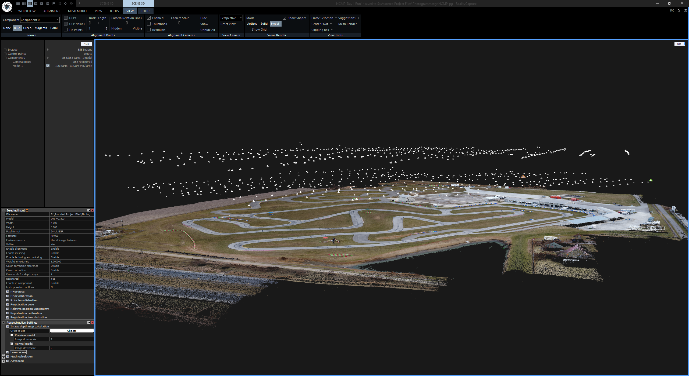
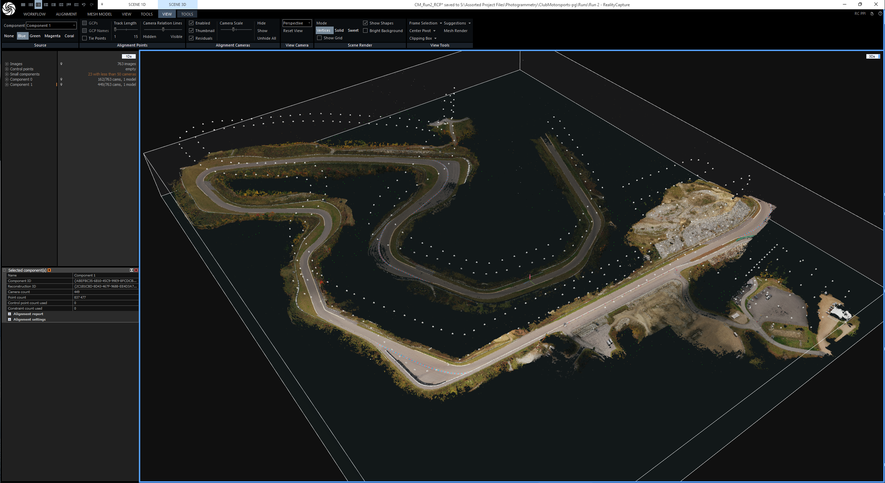
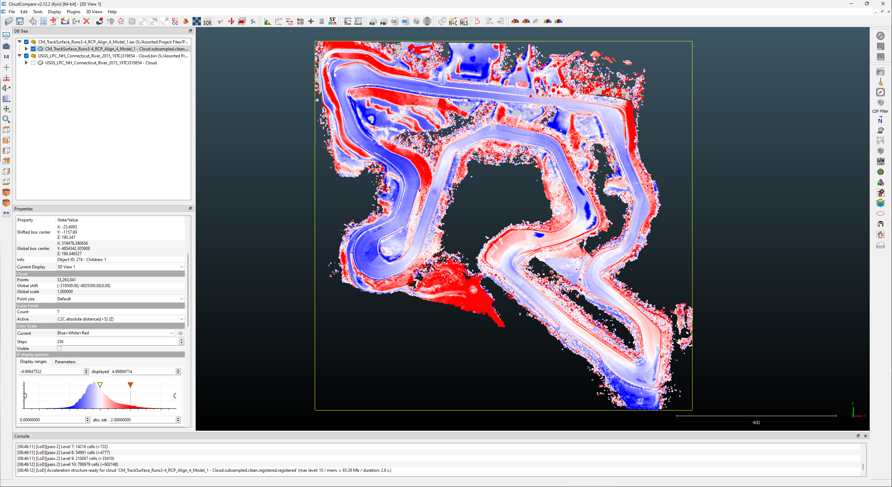
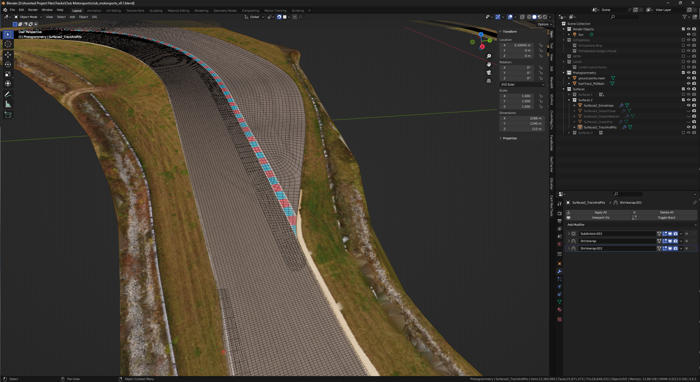

+++
title = "Club Motorsports"
date = 2023-10-10
draft = false
weight = 1
tags = ["modeling", "racing", "racetrack", "commission", "photogrammetry"]
categories = ["projects"]
author = "ohyeah2389"
description = "A modern club circuit in the mountains of New Hampshire."

# Featured image
featuredImage = "clubmoto2024.jpg"
featuredImagePreview = "clubmoto2024.jpg"

# Comment system
comment = false
toc = true
math = false
lightgallery = false
+++

Club Motorsports is a private road course for cars and motorbikes located near Tamworth, New Hampshire. It features around 250 feet of elevation change over its 2.5 mile (4.023 km), 15-turn car circuit, as well as an 8-turn karting layout. The circuit hosts track days, kart races, and other motorsports events.

# 2023

I was commissioned to create this model by a member of the real track after his son, an avid simracer, tried some of my previous track models I had posted on Overtake.gg (named RaceDepartment at the time). My initial research and data aggregation showed that the track was not well-covered by publicly available data, which was further complicated by the tricky terrain and elevation change of the track. The latest available aerial LiDAR dataset at the time was from 2015. It was captured while the track was being constructed, and there were piles of dirt covering the yet-unpaved areas. Normally, this would have made the project impossible, but the client offered to attempt to capture novel data with their own equipment, a camera quadcopter ("drone"), after noting that I had captured data for my [G&J Kartway](../gj_kartway/) and [New Castle Motorsports Park](../new_castle_mp/) projects using my own drone.

This presented an interesting challenge: conveying my own experience via instruction to an interested and motivated student, who was also a client that their own work benefited. This was done in a series of comprehensive but concise explanations of the general process, as well as important operational considerations from the practices I had developed during my own experiments and operation of my drone. This included advice relating to camera shooting angles, ground pixel density at different flight heights, motion blur and distortion due to rolling shutter at different flight speeds, differing lighting conditions causing issues with the photogrammetry engine, and more. After this, the client and I conducted a series of test runs wherein the client would fly a flight plan and I would analyze and process the data from that test flight, noting areas for improvement on the next flight, until we arrived at a suitable workflow. 

Finally, in the Fall of 2023, the client flew the operational series of flights to capture the required data: over 3,000 high-quality, low-distortion, consistently-lit photos, which I was then able to process in my photogrammetry software, RealityCapture, to produce a detailed, high-resolution road surface reference mesh. We ran into some slight snags during the validation of the data versus the uncovered areas of the ground-truth 2015 USGS aerial LiDAR scan, which I was able to mostly correct using "virtual" ground control points captured from the 2015 USGS scan and used to correct the bulk inaccuracy of the photogrammetry mesh.

I was then able to model the track, which was a challenging but rewarding process. It was the largest dataset I had worked with so far, which required some workflow improvements and careful accuracy considerations.

# 2024

In early 2024, I recieved an interesting message from the client and another new partner. This new partner, as the client introduced, owned a DJI Matrice 350 RTK with a DJI Zenmuse L2 sensor, which he wanted to scan the track with. He then intended to send me the data at no cost for the purpose of enhancing the precision and overall accuracy of the model I had already created. I discussed this with the client, as this would involve a not-insignificant amount of extra time investment (and therefore cost) to integrate, and the client decided to take the partner up on the offer. I worked with the partner to recieve and process the data, which was quite challenging but very informative (and quite fun for me to learn). The data consisted of a set of 4,000 45 megapixel photos (which the client had thankfully already processed into a 12.6 gigapixel (!!!) orthophoto) and a 513 million point LiDAR dataset with fused color information. The integration and import into my modeling workflow was difficult, but the results would be worth it.

The new 2024 model uses this local drone LiDAR data as a base layer. The scan is significantly closer to the (incomplete) USGS reference data than the photogrammetry scan was, and this required modifying the surface mesh and replacing all the non-surface objects, some of which I updated and remodeled along the way.

The final model represents the main circuit and kart track as they were during the scan in mid 2024. The project is my longest running paid project to date, with the total billed time sitting at 126.59 hours. The model is available at [Overtake.gg](https://www.overtake.gg/downloads/club-motorsports-2024.65302/) for free, non-commercial usage. I've also allowed the track itself to use the model in their on-site simulators, which I've been told they occasionally use for driver training before sending people out on the real track for the first time. 

As of June 2025, Overtake lists over 5,000 downloads and 25 reviews, all of which are 5/5 stars.